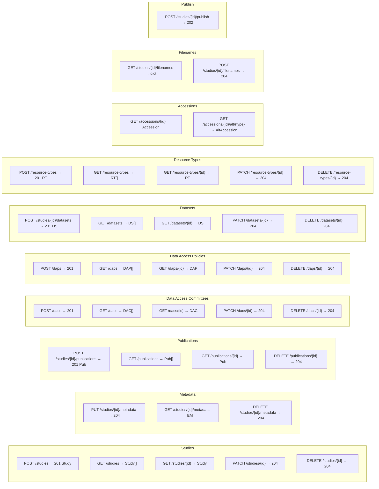

# SRS REST API Endpoint Map (37 routes)

```mermaid
graph LR
    subgraph Studies
        S1["POST /studies → 201 Study"]
        S2["GET /studies → Study[]"]
        S3["GET /studies/{id} → Study"]
        S4["PATCH /studies/{id} → 204"]
        S5["DELETE /studies/{id} → 204"]
    end

    subgraph Metadata
        M1["PUT /studies/{id}/metadata → 204"]
        M2["GET /studies/{id}/metadata → EM"]
        M3["DELETE /studies/{id}/metadata → 204"]
    end

    subgraph Publications
        P1["POST /studies/{id}/publications → 201 Pub"]
        P2["GET /publications → Pub[]"]
        P3["GET /publications/{id} → Pub"]
        P4["DELETE /publications/{id} → 204"]
    end

    subgraph DAC["Data Access Committees"]
        C1["POST /dacs → 201"]
        C2["GET /dacs → DAC[]"]
        C3["GET /dacs/{id} → DAC"]
        C4["PATCH /dacs/{id} → 204"]
        C5["DELETE /dacs/{id} → 204"]
    end

    subgraph DAP["Data Access Policies"]
        D1["POST /daps → 201"]
        D2["GET /daps → DAP[]"]
        D3["GET /daps/{id} → DAP"]
        D4["PATCH /daps/{id} → 204"]
        D5["DELETE /daps/{id} → 204"]
    end

    subgraph Datasets
        DS1["POST /studies/{id}/datasets → 201 DS"]
        DS2["GET /datasets → DS[]"]
        DS3["GET /datasets/{id} → DS"]
        DS4["PATCH /datasets/{id} → 204"]
        DS5["DELETE /datasets/{id} → 204"]
    end

    subgraph ResourceTypes["Resource Types"]
        RT1["POST /resource-types → 201 RT"]
        RT2["GET /resource-types → RT[]"]
        RT3["GET /resource-types/{id} → RT"]
        RT4["PATCH /resource-types/{id} → 204"]
        RT5["DELETE /resource-types/{id} → 204"]
    end

    subgraph Accessions
        A1["GET /accessions/{id} → Accession"]
        A2["GET /accessions/{id}/alt/{type} → AltAccession"]
    end

    subgraph Filenames
        F1["GET /studies/{id}/filenames → dict"]
        F2["POST /studies/{id}/filenames → 204"]
    end

    subgraph Publish
        PB1["POST /studies/{id}/publish → 202"]
    end
```
