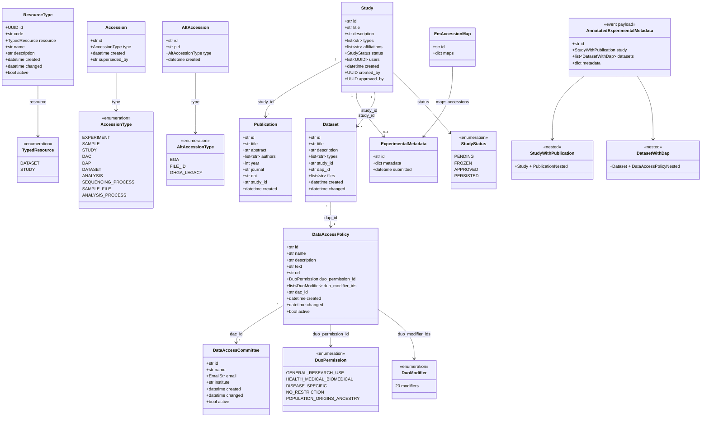

# SRS Entity Model (UML Class Diagram)

```mermaid
classDiagram
    direction TB

    class StudyStatus {
        <<enumeration>>
        PENDING
        FROZEN
        APPROVED
        PERSISTED
    }

    class TypedResource {
        <<enumeration>>
        DATASET
        STUDY
    }

    class AccessionType {
        <<enumeration>>
        EXPERIMENT
        SAMPLE
        STUDY
        DAC
        DAP
        DATASET
        ANALYSIS
        SEQUENCING_PROCESS
        SAMPLE_FILE
        ANALYSIS_PROCESS
    }

    class AltAccessionType {
        <<enumeration>>
        EGA
        FILE_ID
        GHGA_LEGACY
    }

    class DuoPermission {
        <<enumeration>>
        GENERAL_RESEARCH_USE
        HEALTH_MEDICAL_BIOMEDICAL
        DISEASE_SPECIFIC
        NO_RESTRICTION
        POPULATION_ORIGINS_ANCESTRY
    }

    class DuoModifier {
        <<enumeration>>
        20 modifiers
    }

    class Study {
        +str id
        +str title
        +str description
        +list~str~ types
        +list~str~ affiliations
        +StudyStatus status
        +list~UUID~ users
        +datetime created
        +UUID created_by
        +UUID approved_by
    }

    class ExperimentalMetadata {
        +str id
        +dict metadata
        +datetime submitted
    }

    class Publication {
        +str id
        +str title
        +str abstract
        +list~str~ authors
        +int year
        +str journal
        +str doi
        +str study_id
        +datetime created
    }

    class DataAccessCommittee {
        +str id
        +str name
        +EmailStr email
        +str institute
        +datetime created
        +datetime changed
        +bool active
    }

    class DataAccessPolicy {
        +str id
        +str name
        +str description
        +str text
        +str url
        +DuoPermission duo_permission_id
        +list~DuoModifier~ duo_modifier_ids
        +str dac_id
        +datetime created
        +datetime changed
        +bool active
    }

    class Dataset {
        +str id
        +str title
        +str description
        +list~str~ types
        +str study_id
        +str dap_id
        +list~str~ files
        +datetime created
        +datetime changed
    }

    class ResourceType {
        +UUID id
        +str code
        +TypedResource resource
        +str name
        +str description
        +datetime created
        +datetime changed
        +bool active
    }

    class Accession {
        +str id
        +AccessionType type
        +datetime created
        +str superseded_by
    }

    class AltAccession {
        +str id
        +str pid
        +AltAccessionType type
        +datetime created
    }

    class EmAccessionMap {
        +str id
        +dict maps
    }

    class AnnotatedExperimentalMetadata {
        <<event payload>>
        +str id
        +StudyWithPublication study
        +list~DatasetWithDap~ datasets
        +dict metadata
    }

    class StudyWithPublication {
        <<nested>>
        +Study + PublicationNested
    }

    class DatasetWithDap {
        <<nested>>
        +Dataset + DataAccessPolicyNested
    }

    Study "1" --> "*" Publication : study_id
    Study "1" --> "0..1" ExperimentalMetadata : study_id
    Study "1" --> "*" Dataset : study_id
    Study --> StudyStatus : status
    Dataset "*" --> "1" DataAccessPolicy : dap_id
    DataAccessPolicy "*" --> "1" DataAccessCommittee : dac_id
    DataAccessPolicy --> DuoPermission : duo_permission_id
    DataAccessPolicy --> DuoModifier : duo_modifier_ids
    ResourceType --> TypedResource : resource
    Accession --> AccessionType : type
    AltAccession --> AltAccessionType : type
    EmAccessionMap --> ExperimentalMetadata : maps accessions
    AnnotatedExperimentalMetadata --> StudyWithPublication
    AnnotatedExperimentalMetadata --> DatasetWithDap
```
